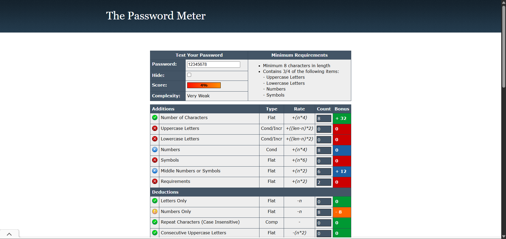
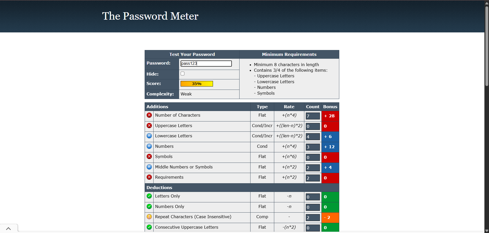
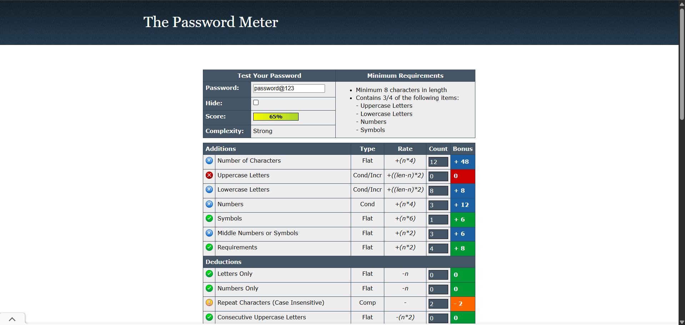
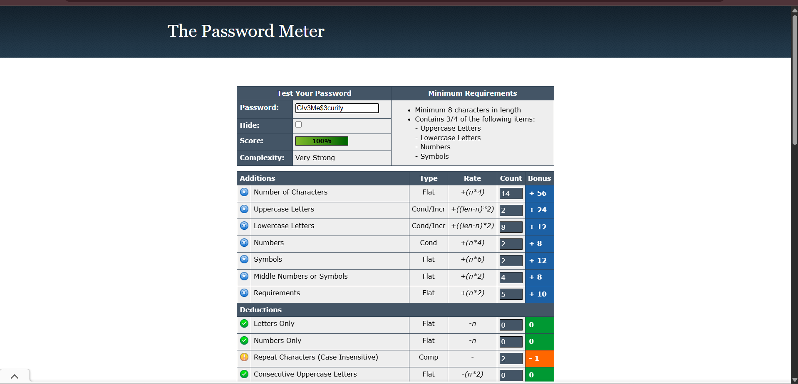
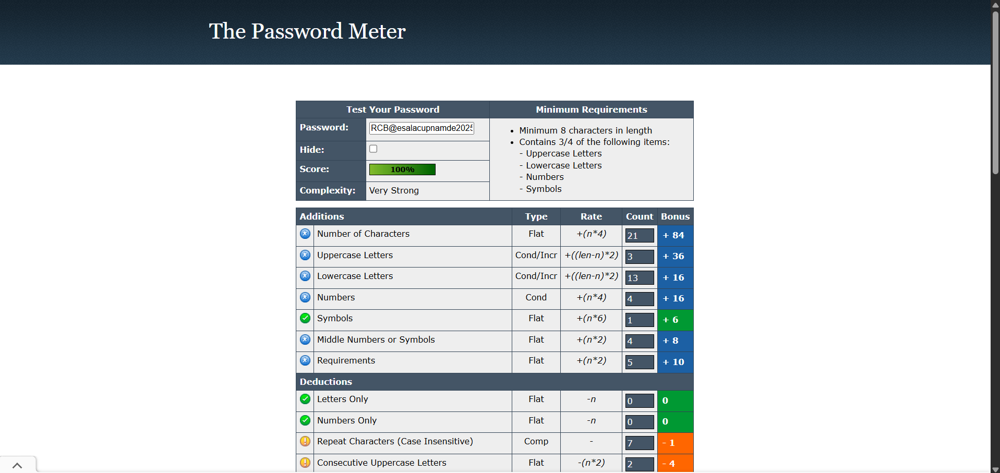

# Password Strength Analysis Report

**Objective**: Understand what makes a password strong and test it against password strength tools.

## Tools Used
- **Password Meter**: Online password strength checker (passwordmeter.com)
- **Testing Method**: Manual testing with various password combinations

## Password Analysis Results

### Test Case 1: Extremely Weak Password
**Password**: `12345678`
- **Score**: 4%
- **Complexity**: Very Weak
- **Length**: 8 characters

**Breakdown**:
-  Number of characters (8 characters) - +32 bonus
-  Missing uppercase letters (0 characters) - 0 bonus
-  Missing lowercase letters (0 characters) - 0 bonus
-  Contains numbers (8 characters) - 0 bonus (conditional)
-  Missing symbols (0 characters) - 0 bonus
-  Middle numbers (6 characters) - +12 bonus
-  Numbers only penalty - -8 deduction

**Analysis**: Extremely weak due to being numbers only and following a consecutive pattern - easily guessed.

### Test Case 2: Very Weak Password
**Password**: `pass123`
- **Score**: 35%
- **Complexity**: Weak
- **Length**: 7 characters

**Breakdown**:
-  Contains lowercase letters (4 characters) - +6 bonus
-  Missing uppercase letters (0 characters) - 0 bonus
-  Contains numbers (3 characters) - +12 bonus
-  Missing symbols (0 characters) - 0 bonus
-  Middle numbers (2 characters) - +4 bonus
-  Has repeat characters (2 occurrences) - -2 penalty

**Analysis**: Very weak password due to short length, dictionary word base, and missing character types.

### Test Case 3: Moderate Password
**Password**: `password@123`
- **Score**: 65%
- **Complexity**: Strong
- **Length**: 12 characters

**Breakdown**:
-  Contains lowercase letters (8 characters) - +8 bonus
-  Missing uppercase letters (0 characters) - 0 bonus
-  Contains numbers (3 characters) - +12 bonus
-  Contains symbols (1 character) - +6 bonus
-  Has repeat characters (case insensitive) - -2 penalty

**Analysis**: Despite being labeled as "Strong" by the tool, this password is relatively weak due to being a common dictionary word with predictable number/symbol substitution.

### Test Case 4: Strong Password
**Password**: `G!v3Me$3cur!ty`
- **Score**: 100%
- **Complexity**: Very Strong
- **Length**: 14 characters

**Breakdown**:
-  Contains uppercase letters (2 characters) - +24 bonus
- Contains lowercase letters (8 characters) - +12 bonus
-  Contains numbers (2 characters) - +8 bonus
-  Contains symbols (2 characters) - +12 bonus
-  Middle numbers/symbols (4 characters) - +8 bonus
-  Meets requirements (5 categories) - +10 bonus
-  Has repeat characters (case insensitive) - -1 penalty

**Analysis**: Excellent password strength with good character diversity and unpredictable pattern.

### Test Case 5: Very Strong Password
**Password**: `RCB@salacupname2024`
- **Score**: 100%
- **Complexity**: Very Strong
- **Length**: 21 characters

**Breakdown**:
-  Contains uppercase letters (3 characters) - +36 bonus
-  Contains lowercase letters (13 characters) - +16 bonus
-  Contains numbers (4 characters) - +16 bonus
-  Contains symbols (1 character) - +6 bonus
-  Middle numbers/symbols (4 characters) - +8 bonus
-  Meets requirements (5 categories) - +10 bonus
-  Has repeat characters (7 occurrences) - -1 penalty
-  Consecutive uppercase letters (2 occurrences) - -4 penalty

**Analysis**: Very strong due to length and character diversity, though it contains some predictable elements.

## Key Findings

### What Makes a Password Strong:
1. **Length**: Longer passwords (14+ characters) significantly increase security
2. **Character Diversity**: Mix of uppercase, lowercase, numbers, and symbols
3. **Unpredictability**: Avoid dictionary words, common patterns, and personal information
4. **No Repetition**: Minimize repeated characters and patterns

### Password Strength Factors:

#### Positive Factors (Additions):
- **Character Count**: Each additional character increases strength exponentially
- **Character Types**: Using all four types (upper, lower, numbers, symbols) maximizes entropy
- **Middle Complexity**: Numbers and symbols in the middle (not just at the end) improve strength
- **Meeting Requirements**: Satisfying multiple security criteria

#### Negative Factors (Deductions):
- **Dictionary Words**: Common words significantly weaken passwords
- **Repeated Characters**: Reduce overall entropy
- **Consecutive Characters**: Patterns like "ABC" or "123" are easily guessed
- **Keyboard Patterns**: Sequences like "qwerty" or "12345"

## Common Password Attack Methods

### 1. Brute Force Attacks
- **Method**: Systematically trying every possible combination
- **Defense**: Longer passwords exponentially increase time required
- **Time Complexity**: Increases by character set size ^ password length

### 2. Dictionary Attacks
- **Method**: Using lists of common passwords and words
- **Defense**: Avoid dictionary words, even with simple substitutions
- **Common Targets**: "password", "123456", "admin", etc.

### 3. Social Engineering
- **Method**: Using personal information (names, dates, interests)
- **Defense**: Avoid personal information in passwords
- **Examples**: Birth dates, pet names, favorite teams

## Best Practices for Strong Passwords

### Do's:
- ✅ Use minimum 12-16 characters (longer is better)
- ✅ Include all character types (upper, lower, numbers, symbols)
- ✅ Use passphrases with random words
- ✅ Make each password unique for different accounts
- ✅ Use a password manager for generation and storage
- ✅ Enable two-factor authentication when available

### Don'ts:
- ❌ Use dictionary words or common phrases
- ❌ Use personal information (names, dates, addresses)
- ❌ Use keyboard patterns (qwerty, 12345)
- ❌ Reuse passwords across multiple accounts
- ❌ Use simple character substitutions (@ for a, 3 for e)
- ❌ Share passwords or write them down insecurely

## Security Recommendations

### For Individuals:
1. **Password Managers**: Use tools like Bitwarden, LastPass, or 1Password
2. **Passphrase Method**: Use 4-6 random words with special characters
3. **Regular Updates**: Change passwords periodically, especially after breaches
4. **Unique Passwords**: Never reuse passwords across accounts

### For Organizations:
1. **Password Policy**: Enforce minimum complexity requirements
2. **Multi-Factor Authentication**: Implement 2FA/MFA across all systems
3. **Security Training**: Educate users on password best practices
4. **Breach Monitoring**: Monitor for compromised credentials

## Tools and Resources

### Password Strength Checkers:
- Password Meter (passwordmeter.com)
- How Secure Is My Password (howsecureismypassword.net)
- Bitwarden Password Strength Tester

### Password Generators:
- Browser built-in generators
- Password manager generators
- Diceware for passphrases

### Password Managers:
- Bitwarden (open source)
- 1Password
- LastPass
- Dashlane

## Conclusion

Password strength is determined by multiple factors working together: length, complexity, unpredictability, and uniqueness. While password strength meters provide useful feedback, they shouldn't be the only measure of security. The most effective approach combines strong, unique passwords with additional security measures like multi-factor authentication.

The evolution from simple passwords to passphrases represents a significant improvement in both security and usability. Organizations and individuals should prioritize password hygiene as a fundamental cybersecurity practice.

---

